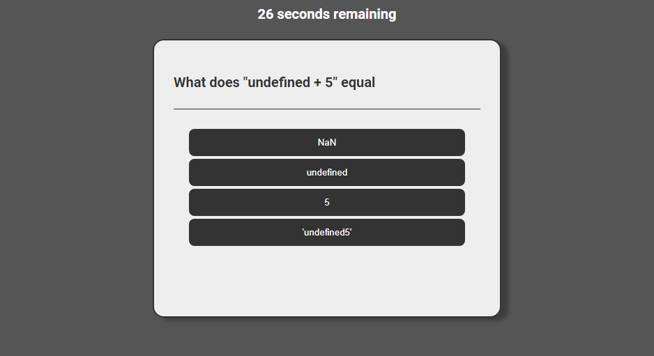

# Coding Quiz

[Deployed Site](https://dcrlsn.github.io/code-quiz/)

## Table of Content

- [Usage](#Usage)
- [Description](#Description)

## Usage
Quick coding knowledge quiz. When the user clicks the start button, they are given 30 seconds to answer the questions. Correct answers score points, incorrect answers subtract time. The user is also able to record their high scores to local storage.

## Description
The site flips through an object array to populate the quiz and determine the correct answers. Score per question is determined by the amount of time remaining, faster answers get more points.